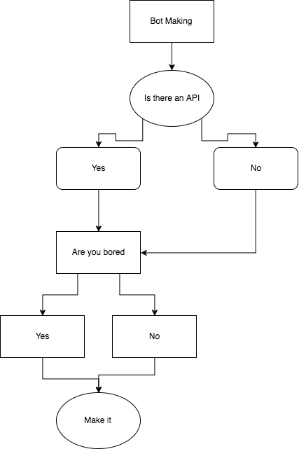

# Discord.ps1

## About
### Discord.ps1 is really pointless way for you to waste 8GB RAM hosting and to connect and interact with the [Discord API](https://discordapp.com/developers/docs/intro) through Powershell.

`Invoke-Discord.ps1` and `Sockets-Discord.ps1` are needed for this to function correctly, 
`Sockets-Discord.ps1` isn't currently public due to it having to use local client id's etc..etc.. Eventually i will find a fix  
## PROJECT IS NO LONGER MAINTAINED BY BRIANNA, @SweetFade (Jess) WILL BE MAINTAINING IT

## Why?
This was originally made as a joke but i decided to attept to make it real, 

## Todo

- [ ] Make the lib actually worth using and stable before sharing.
- [ ] Write docs and make examples on how to connect your bot.
- [ ] Write docs on how to make commands.
## Contributing
Feel free to fork this, Before i break everything
## Help
If you need help with this, I really can't help you, This isn't supposed to be used as a main lib, If you want an actual working lib for a bot use Discord.js or Eris, Maybe you will find others who know them langs, 

# Discord.ps1 Docs/Wiki
Currently in progress
> "The most blue mistake" ~Fade

### SPECIAL THANKS TO
* Powershell V2 itself 
* Powershell Gallery https://www.powershellgallery.com/ - Providing modules
* The really well made docs for ps
* Many powershell modules scattered through github
* Alex - Powershell module maker, Also helped with the concept
* Fade - Fixing the gateway bug
* Jane Petrovna - For finding a async module to work with
* Flexy - Emotional support, Kept me going through the creation of this 
* KaosHeaven - Also emotional support
* **and all of the amazing people in my discord guild!!**
### Powershell Gallery Modules/cmdlets used
* https://www.powershellgallery.com/packages/pspostman/1.0.31 - Managing post requests via the API to `discordapp.com/api/$APIVer/$APIEndpoint` `$APIEndpoint` is managed by sorting the var's to a list
* Autophox - custom powershell module for autostarting the project and starting it backup after a crash as a fail safe, The module can also be used for automation of tasks in a AHK (Autohotkey) style of way 

### The reason why the bot isn't fully on github currently
* 
* Autophox is needed as a runtime module and that is currently a private thing and i do not have plans of sharing it anytime soon
* All this project was made for is a techdemo to show that powershell was capable of running as a discord bot lib
* Even if it was public, The bot wouldn't be stable for use (Crashes and errors), 
* Lastly, Writing the actual bot is the hardest part because you need to setup the entire endpoint structure and make sure your system has the right dependencies (*which we don't actually have a list for yet*)

### Backstory
So me and a few people were talking about making a discord lib with a dumb language so i ended up making a suggestion for Powershell and they had doubt in me,

